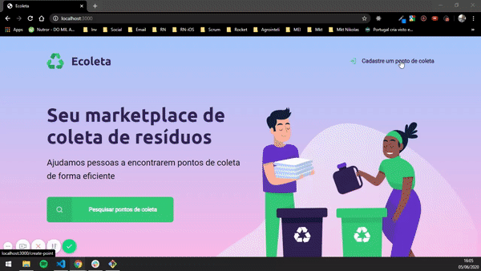

# Ecoleta

Ecoleta é um site feito com o frontend utilizando HTMl, CSS e JS. Para o backend foi utilizado NodeJS com MySQL como banco de dados e que foi desenvolvido durante a semana Next Level Week da RocketSeat.

## Executando o projeto

Faça o clone do repositório

```
https://github.com/leoceolin/Ecoleta---NLW
```

Acesse a pasta referente ao projeto no seu terminal e execute primeiramente um

```
npm install
```

para instalar as dependências.

Rode o projeto com o comando

```
npm start
```

## Executando Frontend

Abra o seu navegador e acesse a url localhost:3000 e terá a visão do projeto

## Construído com

- [NodeJS](https://nodejs.org/en/)
- [ExpressJS](https://expressjs.com/pt-br/)
- [Nodemon](https://nodemon.io/)
- [SQLite](https://www.sqlite.org/index.html)



## Autor

<table>
  <tr>
    <td align="center">
      <a href="http://github.com/leoceolin/">
        
        <br />
        <sub>
          <b>Leonel Ceolin Farias</b>
        </sub>
       </a>
       <br />
       <a href="https://github.com/leoceolin" title="Code">@leoceolin</a>
    </td>
  </tr>
</table>
